Audit Mode: STRICT READ-ONLY
Source Code Changes: 0
Prisma Changes: 0
Database Writes: 0

# BLOOMNEST — FINAL CANONICAL ENTITY RELATIONSHIP DIAGRAM (ERD)

## EXECUTIVE OVERVIEW

This document presents the complete **Canonical Entity Relationship Diagram (ERD)** for the BloomNest platform. 

It defines all 23 relational database entities, primary keys, foreign keys, cardinality, unique constraints, and indexes required for the canonical PostgreSQL database.

---

## 1. MERMAID ENTITY RELATIONSHIP DIAGRAM

```mermaid
erDiagram
    User ||--o| JourneyProfile : "has 1:1"
    User ||--o{ PreconceptionCycleLog : "logs daily"
    User ||--o{ PreconceptionSupplementLog : "tracks daily"
    User ||--o{ HealthVitalLog : "records"
    User ||--o{ BloodSugarLog : "logs diabetes"
    User ||--o{ KickSession : "records session"
    User ||--o{ ContractionLog : "records labor"
    User ||--o{ Medication : "prescribed"
    Medication ||--o{ MedicationAdherenceLog : "has daily logs"
    User ||--o{ Appointment : "schedules"
    User ||--o| BirthPlan : "defines 1:1"
    User ||--o{ HospitalBagItem : "packs"
    User ||--o{ MoodLog : "logs daily"
    User ||--o{ JournalEntry : "writes"
    User ||--o{ UserBabyNameFavorite : "favorites"
    User ||--o{ MedicalReportAttachment : "uploads"
    MedicalReportAttachment ||--o{ ExtractedBiomarker : "contains OCR metrics"
    User ||--o{ EmergencyContact : "has SOS contacts"
    User ||--o{ AgentMemory : "stores AI memories"
    User ||--o{ AgentRun : "executes AI agent runs"
    User ||--o{ TimelineTaskState : "completes weekly tasks"
    User ||--o{ AppNotification : "receives"

    User {
        string id PK "UUID"
        string email UK "Unique Index"
        string passwordHash "Bcrypt Hash"
        string name "Full Name"
        string role "user | admin"
        string preferredLanguage "en, hi, ta, te, mr, bn"
        string theme "soft-pastel-minimal, etc"
        boolean isAudioMuted "Default false"
        boolean hasCompletedOnboarding "Default false"
        datetime createdAt "Default now()"
        datetime updatedAt "Updated on change"
    }

    JourneyProfile {
        string id PK "UUID"
        string userId FK, UK "1:1 Unique index with User"
        string journeyStage "PRE_PREGNANCY | PREGNANCY | POST_PREGNANCY"
        string lmpDate
        string eddDate
        int currentWeek "1 - 42"
        int trimester "1, 2, 3"
        int cycleLengthDays "Default 28"
        int periodDurationDays "Default 5"
        string conceptionGoal
        string babyDob
        string babyName
        string babyGender "Boy | Girl | Surprise"
        string doctorName
        string hospitalName
        string bloodGroup
        datetime createdAt "Default now()"
        datetime updatedAt "Updated on change"
    }

    PreconceptionCycleLog {
        string id PK "UUID"
        string userId FK "Index: [userId, logDate]"
        date logDate "Date object"
        string cervicalMucus "dry | sticky | creamy | watery | eggwhite"
        string lhTestResult "negative | positive | peak"
        float bbtTemperature "Degrees C/F"
        boolean intercourseLogged "Default false"
        json symptoms "Symptom tags array"
        text notes
    }

    PreconceptionSupplementLog {
        string id PK "UUID"
        string userId FK "Index: [userId, logDate]"
        date logDate
        boolean folateTaken "Default false"
        int dosageMcg "Default 400"
        boolean vitaminDTaken "Default false"
        boolean ironTaken "Default false"
    }

    HealthVitalLog {
        string id PK "UUID"
        string userId FK "Index: [userId, recordedAt]"
        datetime recordedAt "Timestamp"
        int systolicBp "mmHg"
        int diastolicBp "mmHg"
        int pulse "bpm"
        float temperature "Degrees C"
        float weightKg "kg"
        int waterMl "Fluid intake volume mL"
        int energyLevel "1 - 10"
        json symptoms "Symptom alerts JSON array"
        string status "NORMAL | ATTENTION | HIGH | SEVERE"
        boolean requiresUrgentAttention "Default false"
    }

    BloodSugarLog {
        string id PK "UUID"
        string userId FK "Index: [userId, recordedAt]"
        datetime recordedAt "Timestamp"
        float glucoseMgDl "mg/dL"
        string context "fasting | 1h_post_meal | 2h_post_meal"
        text notes
    }

    KickSession {
        string id PK "UUID"
        string userId FK "Index: [userId, sessionDate]"
        date sessionDate
        datetime sessionStartTime
        int kickCount "Target 10 kicks"
        int durationMinutes
        text notes
    }

    ContractionLog {
        string id PK "UUID"
        string userId FK "Index: [userId, startTime]"
        datetime startTime
        datetime endTime
        int durationSeconds
        int intervalSeconds
        string intensity "mild | moderate | severe"
        text notes
    }

    Medication {
        string id PK "UUID"
        string userId FK "Index: [userId, isActive]"
        string name
        string dosage
        string time
        string frequency "daily, twice_daily"
        text notes
        boolean isActive "Default true"
    }

    MedicationAdherenceLog {
        string id PK "UUID"
        string medicationId FK "Index: [medicationId, logDate]"
        date logDate
        boolean isTaken "Default false"
        datetime takenAt
    }

    Appointment {
        string id PK "UUID"
        string userId FK "Index: [userId, appointmentDate]"
        string doctorName
        string hospitalName
        datetime appointmentDate
        string purpose
        text notes
        boolean reminderEnabled "Default true"
        string status "upcoming | completed | cancelled"
    }

    BirthPlan {
        string id PK "UUID"
        string userId FK, UK "1:1 Unique index with User"
        string deliveryType "vaginal | c-section-medically-required"
        json painManagement
        string birthPartnerName
        string birthPartnerRole
        string skinToSkin "immediate | delayed"
        string cordClamping "delayed-1-3-mins | immediate"
        json newbornProcedures
        text specialNotes
    }

    HospitalBagItem {
        string id PK "UUID"
        string userId FK "Index: [userId, category]"
        string category "mother | baby | partner | documents"
        string item
        boolean isPacked "Default false"
        int quantity "Default 1"
    }

    MoodLog {
        string id PK "UUID"
        string userId FK "Index: [userId, logDate]"
        date logDate
        string mood
        int intensityScore "1 - 10"
        float sleepHours "Hours"
        string sleepQuality "poor | fair | good | excellent"
        json tags
        text notes
    }

    JournalEntry {
        string id PK "UUID"
        string userId FK "Index: [userId, entryDate]"
        date entryDate
        string title
        text content
        string imageUrl "Single object storage path string"
        string mood
        int weekNumber
        boolean isPrivate "Default false"
    }

    UserBabyNameFavorite {
        string id PK "UUID"
        string userId FK "Index: [userId, isFavorite]"
        string nameId
        string name
        string gender "Girl | Boy | Unisex"
        string meaning
        boolean isFavorite "Default true"
    }

    MedicalReportAttachment {
        string id PK "UUID"
        string userId FK "Index: [userId, scanId]"
        string scanId "anomaly-scan, etc"
        string fileName
        string fileType "pdf | image"
        string fileSize
        string storagePath "S3 Object Storage path"
        datetime uploadedAt
        text notes
    }

    ExtractedBiomarker {
        string id PK "UUID"
        string attachmentId FK "Index: [attachmentId]"
        string category "lab | ultrasound | vitals"
        string label "Hemoglobin, AFI, TSH"
        float numericValue
        string stringValue
        string unit
        string referenceRange
        string status "normal | low | high | borderline"
        string verificationStatus "UNVERIFIED_AI | VERIFIED_BY_USER | VERIFIED_BY_CLINICIAN"
        text interpretation
    }

    EmergencyContact {
        string id PK "UUID"
        string userId FK "Index: [userId, isPrimary]"
        string name
        string relation
        string phone
        string secondaryPhone
        text address
        text notes
        boolean isPrimary "Default false"
    }

    AgentMemory {
        string id PK "UUID"
        string userId FK "Index: [userId, memoryType]"
        string memoryType "PROFILE | JOURNEY | PREFERENCE"
        string summary
        string source "USER_INPUT | OCR_SCAN | VITAL_LOG"
        float confidence "0.0 - 1.0"
        datetime validFrom
        datetime validUntil
        datetime createdAt
    }

    AgentRun {
        string id PK "UUID"
        string userId FK "Index: [userId, startedAt]"
        string message
        string intent "GENERAL | NUTRITION | MEDICAL"
        json agentsInvolved
        string safetyLevel "INFO | WARNING | URGENT"
        boolean requiresHumanReview
        json toolCalls
        string status "COMPLETED | FAILED"
        text error
        datetime startedAt
        datetime completedAt
    }

    TimelineTaskState {
        string id PK "UUID"
        string userId FK "Index: [userId, weekNumber]"
        int weekNumber
        string taskId
        boolean isCompleted "Default false"
        datetime completedAt
    }

    AppNotification {
        string id PK "UUID"
        string userId FK "Index: [userId, isRead]"
        string title
        text message
        string type "reminder | milestone | health"
        boolean isRead "Default false"
        datetime createdAt
    }
```

---

## 2. INDEX & UNIQUE CONSTRAINT SUMMARY

1. **`User`**: Unique index `email`.
2. **`JourneyProfile`**: 1:1 Unique index `userId`.
3. **`BirthPlan`**: 1:1 Unique index `userId`.
4. **`PreconceptionCycleLog`**: Composite Unique Index `[userId, logDate]`.
5. **`PreconceptionSupplementLog`**: Composite Unique Index `[userId, logDate]`.
6. **`HealthVitalLog`**: Index `[userId, recordedAt]`.
7. **`BloodSugarLog`**: Index `[userId, recordedAt]`.
8. **`MedicationAdherenceLog`**: Composite Unique Index `[medicationId, logDate]`.
9. **`MoodLog`**: Composite Unique Index `[userId, logDate]`.
10. **`TimelineTaskState`**: Composite Unique Index `[userId, weekNumber, taskId]`.

---
FINAL VERDICT: GO (Complete ERD & Relational Schema Defined)
