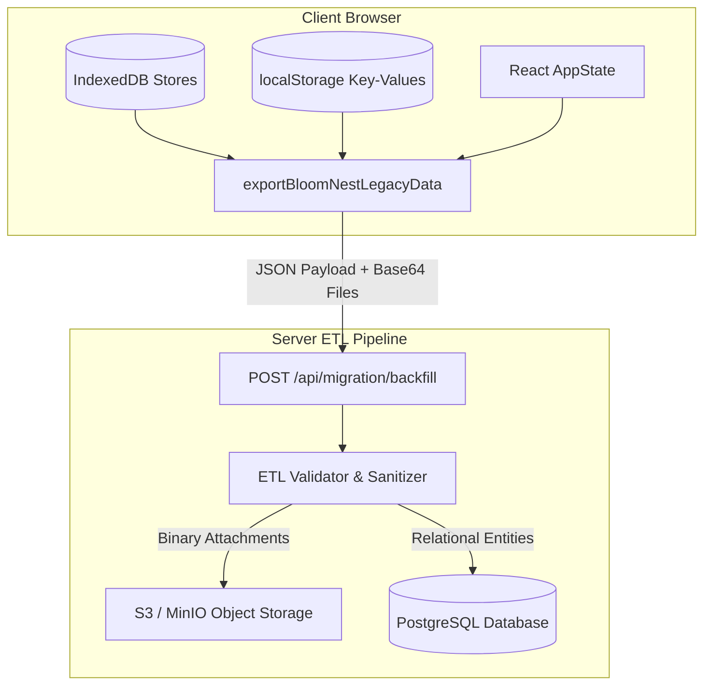

# BloomNest — Legacy Browser Data ETL Specification

## Executive Summary

```text
SCHEMA MIGRATION ≠ LEGACY DATA MIGRATION
```

Executing DDL schema migrations (`CREATE TABLE`, `ALTER TABLE`) creates relational database structures in PostgreSQL, but **does NOT migrate browser-stored data** (IndexedDB, `localStorage`, in-memory `AppState`).

This document provides the authoritative ETL (Extract, Transform, Load) specification to migrate legacy client-side state and Base64-encoded files into canonical PostgreSQL entities and S3 Object Storage without data loss.

---

# 1. Architecture Overview



---

# 2. Extract Phase (Browser Client)

The client application will execute a dedicated extraction script `exportBloomNestLegacyData()` before cutover.

### 2.1 Extraction Targets (25 Canonical Entities)

| Source Location | Storage Key / Store Name | Legacy Payload Type | Target Canonical Model |
| :--- | :--- | :--- | :--- |
| `localStorage` | `bloomnest_user` | JSON String | `User` |
| `localStorage` | `bloomnest_journey` | JSON String | `JourneyProfile` |
| IndexedDB | `preconception_cycle` | Key-Value Store | `PreconceptionCycleLog` |
| IndexedDB | `preconception_supplements` | Key-Value Store | `PreconceptionSupplementLog` |
| IndexedDB | `vitals_weight_bp` | Key-Value Store | `HealthVitalLog` |
| IndexedDB | `blood_sugar` | Key-Value Store | `BloodSugarLog` |
| IndexedDB | `kick_counter` | Key-Value Store | `KickSession` |
| IndexedDB | `contractions` | Key-Value Store | `ContractionLog` |
| IndexedDB | `medications` | Key-Value Store | `Medication` |
| IndexedDB | `medication_logs` | Key-Value Store | `MedicationAdherenceLog` |
| IndexedDB | `appointments` | Key-Value Store | `Appointment` |
| IndexedDB | `birth_plan` | Key-Value Store | `BirthPlan` |
| IndexedDB | `hospital_bag` | Key-Value Store | `HospitalBagItem` |
| IndexedDB | `mood_sleep` | Key-Value Store | `MoodLog` |
| IndexedDB | `journal_entries` | Text + Image Base64 | `JournalEntry` |
| IndexedDB | `baby_names` | Key-Value Store | `UserBabyNameFavorite` |
| IndexedDB | `medical_scans` | Base64 + Meta | `MedicalReportAttachment` |
| IndexedDB | `extracted_biomarkers` | Key-Value Store | `ExtractedBiomarker` |
| IndexedDB | `emergency_contacts` | Key-Value Store | `EmergencyContact` |
| AppState | `agent_memories` | Memory Array | `AgentMemory` |
| AppState | `agent_runs` | Memory Array | `AgentRun` |
| IndexedDB | `task_states` | Key-Value Store | `TimelineTaskState` |
| IndexedDB | `notifications` | Key-Value Store | `AppNotification` |
| Static JSON | `translations` | i18n Dictionary | `Translation` |
| AppState | `pending_mutations` | Memory Array | `SyncMutationAck` |

### 2.2 Extraction JavaScript Implementation Spec

```javascript
/**
 * Extract all legacy client data into a structured payload for migration backfill.
 */
export async function exportBloomNestLegacyData() {
  const userId = localStorage.getItem('bloomnest_user_id');
  if (!userId) throw new Error('Cannot export legacy data without active userId');

  const payload = {
    userId,
    exportedAt: new Date().toISOString(),
    user: JSON.parse(localStorage.getItem('bloomnest_user') || '{}'),
    journeyProfile: JSON.parse(localStorage.getItem('bloomnest_journey') || '{}'),
    preconceptionCycleLogs: await readIndexedDBStore('preconception_cycle'),
    preconceptionSupplementLogs: await readIndexedDBStore('preconception_supplements'),
    healthVitalLogs: await readIndexedDBStore('vitals_weight_bp'),
    bloodSugarLogs: await readIndexedDBStore('blood_sugar'),
    kickSessions: await readIndexedDBStore('kick_counter'),
    contractionLogs: await readIndexedDBStore('contractions'),
    medications: await readIndexedDBStore('medications'),
    medicationAdherenceLogs: await readIndexedDBStore('medication_logs'),
    appointments: await readIndexedDBStore('appointments'),
    birthPlan: await readIndexedDBStore('birth_plan'),
    hospitalBagItems: await readIndexedDBStore('hospital_bag'),
    moodLogs: await readIndexedDBStore('mood_sleep'),
    journalEntries: await readIndexedDBStore('journal_entries'),
    babyNameFavorites: await readIndexedDBStore('baby_names'),
    medicalReportAttachments: await readIndexedDBStore('medical_scans'),
    extractedBiomarkers: await readIndexedDBStore('extracted_biomarkers'),
    emergencyContacts: await readIndexedDBStore('emergency_contacts'),
    timelineTaskStates: await readIndexedDBStore('task_states'),
    notifications: await readIndexedDBStore('notifications')
  };

  return payload;
}
```

---

# 3. Transform Phase (Server ETL Engine)

### 3.1 Date Normalization & Timezone Safety
To eliminate timezone drift (`2026-09-11` becoming `2026-09-10` UTC), all date fields (`lmpDate`, `eddDate`, `babyDob`) are parsed strictly:

```typescript
export function normalizeDateOnly(rawDateString: string): Date {
  const match = rawDateString.match(/^(\d{4})-(\d{2})-(\d{2})/);
  if (!match) throw new Error(`Invalid date format: ${rawDateString}`);
  const [_, year, month, day] = match;
  return new Date(Date.UTC(parseInt(year, 10), parseInt(month, 10) - 1, parseInt(day, 10)));
}
```

### 3.2 Base64 to Object Storage (S3 / MinIO) Conversion
Legacy medical attachments stored as Base64 strings in IndexedDB are extracted, decoded, uploaded to S3, and replaced with clean Object Storage URLs (`storagePath`).

```typescript
export async function processLegacyReportAttachment(
  userId: string,
  attachmentId: string,
  base64Data: string,
  fileName: string,
  fileType: string
): Promise<{ storagePath: string; fileSize: string }> {
  const base64Clean = base64Data.replace(/^data:[^;]+;base64,/, '');
  const buffer = Buffer.from(base64Clean, 'base64');
  
  const storagePath = `uploads/users/${userId}/reports/${attachmentId}_${fileName}`;
  
  await s3Client.putObject({
    Bucket: process.env.S3_BUCKET_NAME!,
    Key: storagePath,
    Body: buffer,
    ContentType: fileType === 'pdf' ? 'application/pdf' : 'image/png',
    Metadata: { userId, originalFileName: fileName }
  });

  return {
    storagePath,
    fileSize: `${buffer.length} bytes`
  };
}
```

---

# 4. Load Phase (PostgreSQL Batch Ingestion)

### 4.1 Server API Endpoint (`POST /api/migration/backfill`)

The server processes backfill payloads inside a single transactional block per user:

```typescript
export async function handleLegacyBackfill(req: Request, res: Response) {
  const payload = req.body;
  const { userId } = payload;

  await prisma.$transaction(async (tx) => {
    // 1. Upsert Journey Profile
    if (payload.journeyProfile) {
      await tx.journeyProfile.upsert({
        where: { userId },
        create: {
          id: payload.journeyProfile.id || undefined,
          userId,
          journeyStage: payload.journeyProfile.journeyStage || 'PREGNANCY',
          lmpDate: payload.journeyProfile.lmpDate ? normalizeDateOnly(payload.journeyProfile.lmpDate) : null,
          eddDate: payload.journeyProfile.eddDate ? normalizeDateOnly(payload.journeyProfile.eddDate) : null,
          babyDob: payload.journeyProfile.babyDob ? normalizeDateOnly(payload.journeyProfile.babyDob) : null,
          bloodGroup: payload.journeyProfile.bloodGroup
        },
        update: {}
      });
    }

    // 2. Process Medical Report Attachments & S3 Upload
    for (const att of payload.medicalReportAttachments || []) {
      const { storagePath, fileSize } = await processLegacyReportAttachment(
        userId, att.id, att.base64Data, att.fileName, att.fileType
      );

      const reportRecord = await tx.medicalReportAttachment.upsert({
        where: { id: att.id },
        create: {
          id: att.id,
          userId,
          scanId: att.scanId || 'general-scan',
          fileName: att.fileName,
          fileType: att.fileType || 'image',
          fileSize,
          storagePath,
          uploadedAt: new Date(att.uploadedAt || Date.now())
        },
        update: {}
      });
    }

    // 3. Migrate Extracted Biomarkers with Deduplication Strategy
    for (const bio of payload.extractedBiomarkers || []) {
      await tx.extractedBiomarker.upsert({
        where: {
          attachmentId_label: {
            attachmentId: bio.attachmentId,
            label: bio.label
          }
        },
        create: {
          id: bio.id,
          attachmentId: bio.attachmentId,
          category: bio.category || 'lab',
          label: bio.label,
          numericValue: bio.numericValue,
          stringValue: bio.stringValue,
          unit: bio.unit,
          referenceRange: bio.referenceRange,
          status: bio.status || 'normal',
          verificationStatus: bio.verificationStatus || 'UNVERIFIED_AI'
        },
        update: {
          numericValue: bio.numericValue,
          stringValue: bio.stringValue,
          unit: bio.unit,
          referenceRange: bio.referenceRange,
          status: bio.status || 'normal',
          updatedAt: new Date()
        }
      });
    }
  });

  return res.json({ success: true, message: 'Legacy data successfully migrated to PostgreSQL & S3' });
}
```

---

# 5. Data Reconciliation & Verification

1. **Entity Count Match**: Compare IndexedDB count against PostgreSQL count per user for all 25 canonical entities.
2. **Binary Integrity Check**: Ensure all uploaded S3 keys respond with `HTTP 200 OK`.
3. **Biomarker Deduplication Check**: Confirm zero duplicate `(attachmentId, label)` entries exist in PostgreSQL.
