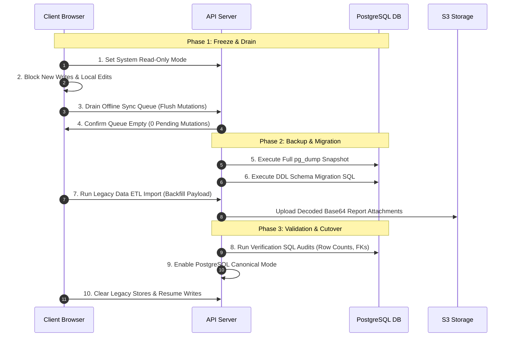

# BloomNest — Migration Execution Checklist & Cutover Plan

## Overview

This document defines the **strictest 10-step cutover sequence** for migrating BloomNest from legacy browser-canonical mode to canonical PostgreSQL & S3 Object Storage across all 25 canonical models.

---

# 1. 10-Step Cutover Sequence



---

# 2. Detailed Execution Checklist

### Phase 1: Preparation & Maintenance Window

- [ ] **Step 1: Enable Application Read-Only Mode**
  - Set feature flag `NEXT_PUBLIC_MAINTENANCE_MODE=true` in deployment environment.
  - Display user notification banner: *"BloomNest is performing scheduled database sync optimization. Read-only mode active."*

- [ ] **Step 2: Block New Local Client Writes**
  - Disable form submissions and mutation handlers in browser state.
  - Reject new client mutations with HTTP 503 (`Service Unavailable / Sync Drain in Progress`).

- [ ] **Step 3: Drain Offline Sync Queue**
  - Trigger `flushOfflineQueue()` on all active clients.
  - Process all pending `SyncMutationAck` items.

- [ ] **Step 4: Verify Offline Queue is Fully Drained**
  - Run client check: `getPendingMutationCount() === 0`.
  - Confirm server has processed all `clientMutationId` requests.

---

### Phase 2: Database Snapshot & DDL Execution

- [ ] **Step 5: Execute Pre-Migration Database Backup**
  - Run full PostgreSQL backup command:
    ```bash
    pg_dump -h $DB_HOST -U $DB_USER -d $DB_NAME -F c -b -v -f "bloomnest_pre_migration_backup_$(date +%Y%m%d_%H%M%S).dump"
    ```
  - Verify backup file size is non-zero and store in secure offsite location.

- [ ] **Step 6: Execute Review DDL Migration SQL**
  - Run transactional SQL script `BLOOMNEST_MIGRATION_SQL_REVIEW.sql`:
    ```bash
    psql -h $DB_HOST -U $DB_USER -d $DB_NAME -f BLOOMNEST_MIGRATION_SQL_REVIEW.sql
    ```
  - Verify output log ends with `COMMIT` and contains zero `ERROR` codes.

---

### Phase 3: Data Import & Validation

- [ ] **Step 7: Execute Legacy Data ETL & S3 Backfill**
  - Trigger server ETL endpoint for all active users:
    ```bash
    curl -X POST https://api.bloomnest.app/api/migration/backfill \
      -H "Authorization: Bearer $ADMIN_SECRET" \
      -H "Content-Type: application/json"
    ```
  - Monitor S3 upload progress and log output for errors.

- [ ] **Step 8: Run Post-Migration SQL Integrity Audits**
  - **Check 1: Model & Table Count Verification**
    ```sql
    SELECT count(*) FROM information_schema.tables WHERE table_schema = 'public';
    -- Expected result: 25 tables
    ```
  - **Check 2: ExtractedBiomarker Uniqueness Verification**
    ```sql
    SELECT "attachmentId", "label", COUNT(*) 
    FROM "ExtractedBiomarker" 
    GROUP BY "attachmentId", "label" 
    HAVING COUNT(*) > 1;
    -- Expected result: 0 rows (No duplicates)
    ```
  - **Check 3: Orphaned Record Verification**
    ```sql
    SELECT count(*) FROM "JourneyProfile" jp 
    LEFT JOIN "User" u ON jp."userId" = u.id 
    WHERE u.id IS NULL;
    -- Expected result: 0 rows
    ```
  - **Check 4: Date Consistency Verification**
    ```sql
    SELECT "lmpDate" FROM "JourneyProfile" 
    WHERE "lmpDate"::text LIKE '%00:00:00%';
    -- Confirm pure DATE types without timezone offsets
    ```

---

### Phase 4: Production Cutover & Resume

- [ ] **Step 9: Enable PostgreSQL Canonical Mode**
  - Update server configuration: `DATABASE_CANONICAL_MODE=true`.
  - Disable maintenance mode: `NEXT_PUBLIC_MAINTENANCE_MODE=false`.

- [ ] **Step 10: Clear Legacy Browser Stores & Resume Client Writes**
  - Send client command to set `localStorage.setItem('bloomnest_canonical', 'postgres')`.
  - Safely purge legacy IndexedDB databases.
  - Resume full read/write operations.

---

# 3. Emergency Rollback Plan

If any critical failure or unrecoverable data mismatch occurs during Phase 2 or Phase 3:

1. **Abort Cutover**:
   Set `DATABASE_CANONICAL_MODE=false` and keep client app in IndexedDB mode.
2. **Restore PostgreSQL Database**:
   ```bash
   pg_restore -h $DB_HOST -U $DB_USER -d $DB_NAME -c -v "bloomnest_pre_migration_backup_YYYYMMDD_HHMMSS.dump"
   ```
3. **Purge S3 Staging Directory**:
   Remove any partially uploaded migration files from S3 bucket.
4. **Notify Incident Lead**:
   Document failure cause in post-mortem audit.
